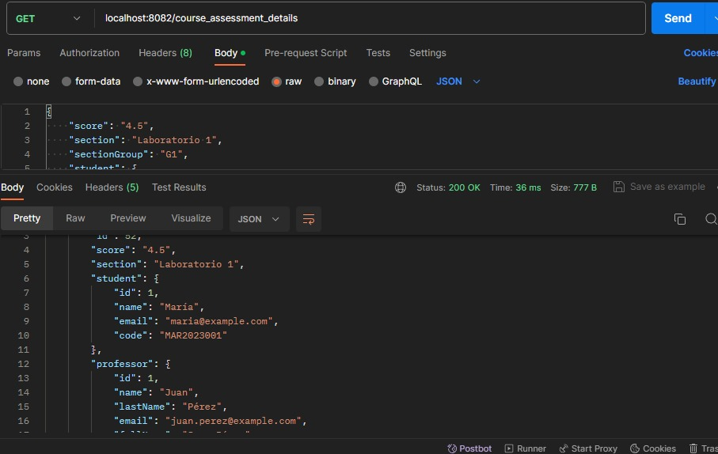
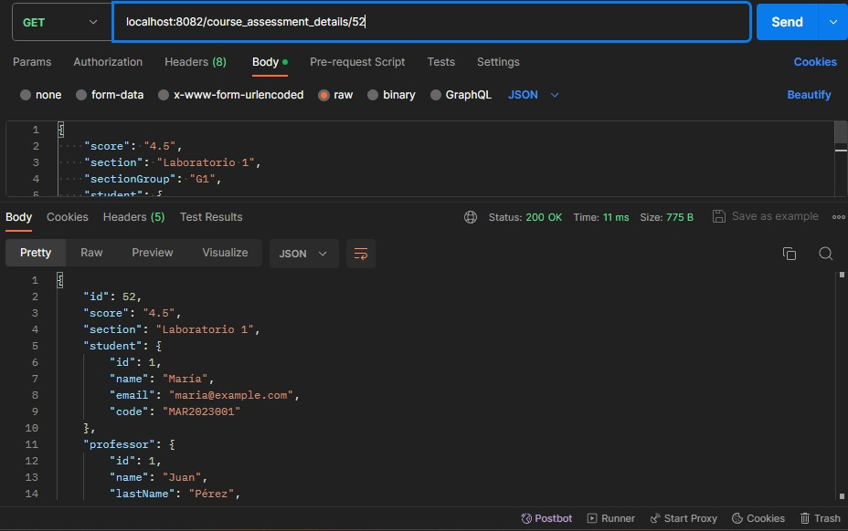
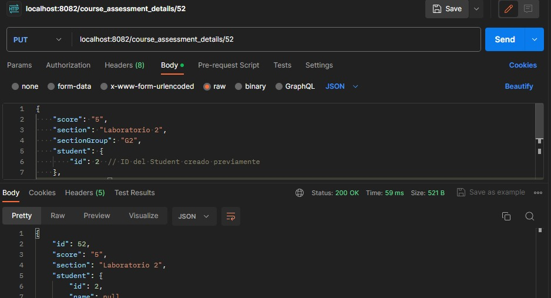
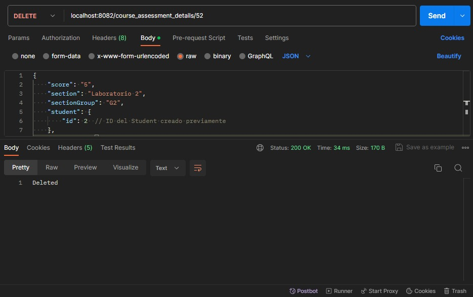

### PARA ESTA HKT3 HEMOS UTILIZADO POSTMAN PARA LOS REQUEST Y ESTO FUE LO QUE REALIZAMOS

### GET /course_assessment_details
Realiza una solicitud GET para recuperar todos los detalles de la evaluación del curso.

### GET /course_assessment_details/{id}
Realiza una solicitud GET para obtener detalles específicos de la evaluación del curso identificados por `{id}`.

### POST /course_assessment_details
Realiza una solicitud POST para crear nuevos detalles de la evaluación del curso.

### PUT /course_assessment_details/{id}
Realiza una solicitud PUT para actualizar los detalles de la evaluación del curso identificados por `{id}`.

### DELETE /course_assessment_details/{id}
Realiza una solicitud DELETE para eliminar los detalles de la evaluación del curso identificados por `{id}`.

